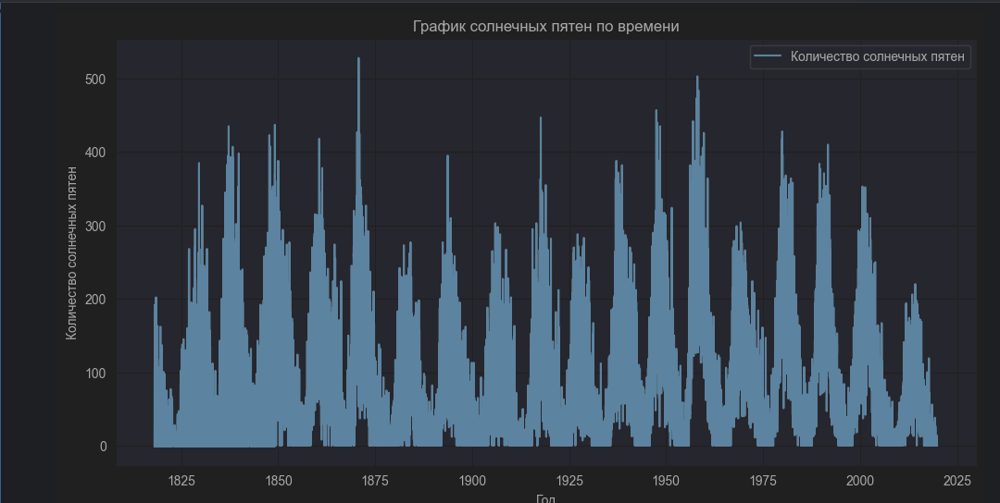

# Учебное задание из программы аспирантуры

## Анализ данных о солнечных пятнах
### Провести анализ активности солнечных пятен и построить графики на основе полученных данных

## Результирующие графики

--------------